# Phase 2 Final Summary: Institutional Intelligence Layer

## Purpose

Phase 2 turns raw candle observations into a structured institutional market assessment suitable for simulation review, paper-trade management, analytics, and client dashboards. It is an intelligence layer, not a live execution system.

## Completed Architecture

The completed institutional pipeline includes:

1. Market structure foundation, swings, liquidity, premium/discount, and displacement
2. Liquidity sweeps and fair value gaps
3. Order blocks and breaker blocks
4. BOS, CHOCH, and MSS structure events
5. Confluence scoring and multi-timeframe alignment
6. Session and killzone timing
7. Institutional entry models and setup validation gates
8. Simulation decisions and paper-trade lifecycle
9. Position management and institutional orchestration
10. AI market narrative and reasoning
11. Performance analytics and optimization recommendations
12. Unified dashboard context
13. Final readiness, safety audit, and client-demo reporting

## Institutional Intelligence Flow

```mermaid
flowchart LR
    A["Candles and Market Context"] --> B["Structure, Liquidity, FVG, Blocks"]
    B --> C["Confluence and Alignment"]
    C --> D["Session Timing and Entry Models"]
    D --> E["Validation Gates"]
    E --> F["Simulation Decision"]
    F --> G["Paper Trade and Management"]
    G --> H["Analytics, Reasoning, Dashboard"]
    H --> I["Completion and Safety Report"]
```



## Safety Boundaries

- Every decision and lifecycle action is simulation-only.
- Live broker execution is disabled.
- No broker order-submission path is provided by the institutional layer.
- Readiness and safety endpoints inspect route coverage and backend source protections.
- Missing market data degrades to safe, non-actionable reporting.

## Dashboard And Client Readiness

The backend supplies compact dashboard cards, alerts, recommendations, market narrative, performance reporting, completion status, and demo-friendly summaries. Client-facing outputs intentionally explain why simulation is ready, waiting, avoided, or under paper-position management.

Key endpoints:

```text
http://127.0.0.1:8000/institutional/demo/XAUUSD
http://127.0.0.1:8000/institutional/dashboard/XAUUSD
http://127.0.0.1:8000/institutional/reasoning/summary/XAUUSD
http://127.0.0.1:8000/institutional/phase2/completion-report
```

## Final Verification

```powershell
python tests/regression_routes_verification.py
python tests/phase2_day19_verification.py
python tests/phase2_full_verification.py
```

## Next Phase Direction

Phase 3 should start with operator-facing visualization and historical simulation observability: chart-linked institutional events, dashboard state history, replay comparison, and performance drill-down built on this certified backend.
